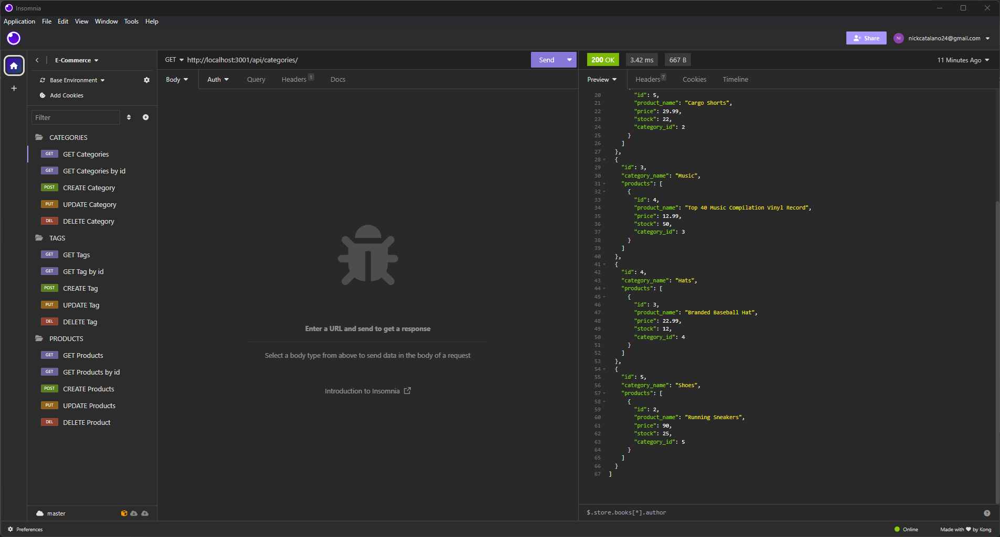

# E-Commerce Backend Code Challenge

## Table of Contents

- [Description](#description)
- [Installation](#installation)
- [Usage](#usage)
- [License](#license)
- [Image](#image)
- [Questions](#questions)

## Description

This was a challenge to add the necessary backend code in order to get, create, update, and delete data from an e-commerce site. To do so, I used Sequelize and MySQL, and tested the code using Insomnia Core. The application will not be deployed.

## Installation

To install, first clone the repo to your own local machine. Right click on the package.json file, and open with integrated terminal. In the terminal, run `npm i` to install the necessary node_modules.

Then navigate to the db folder within the terminal, and log in to mysql. Once logged in, run `source schema.sql` and `source seeds.sql`.

Next, open the .env.EXAMPLE file, rename it to .env and enter your MySQL user and password within the quotes.

Return to the root folder within the terminal, and enter `npm run seed` to seed the database.

Finally, to run the application, run `npm start`.

## Usage

Please follow my walkthrough tutorial on how to use using Insomnia Core:

https://youtu.be/3UjyXJ7V4lc

## License

This project is licensed under the [MIT](https://opensource.org/licenses/MIT) license.

## Image

## Questions

If you have any questions, please contact me using the following:

- Github: github.com/nicholascatalano
- Email: nickcatalano24@gmail.com
